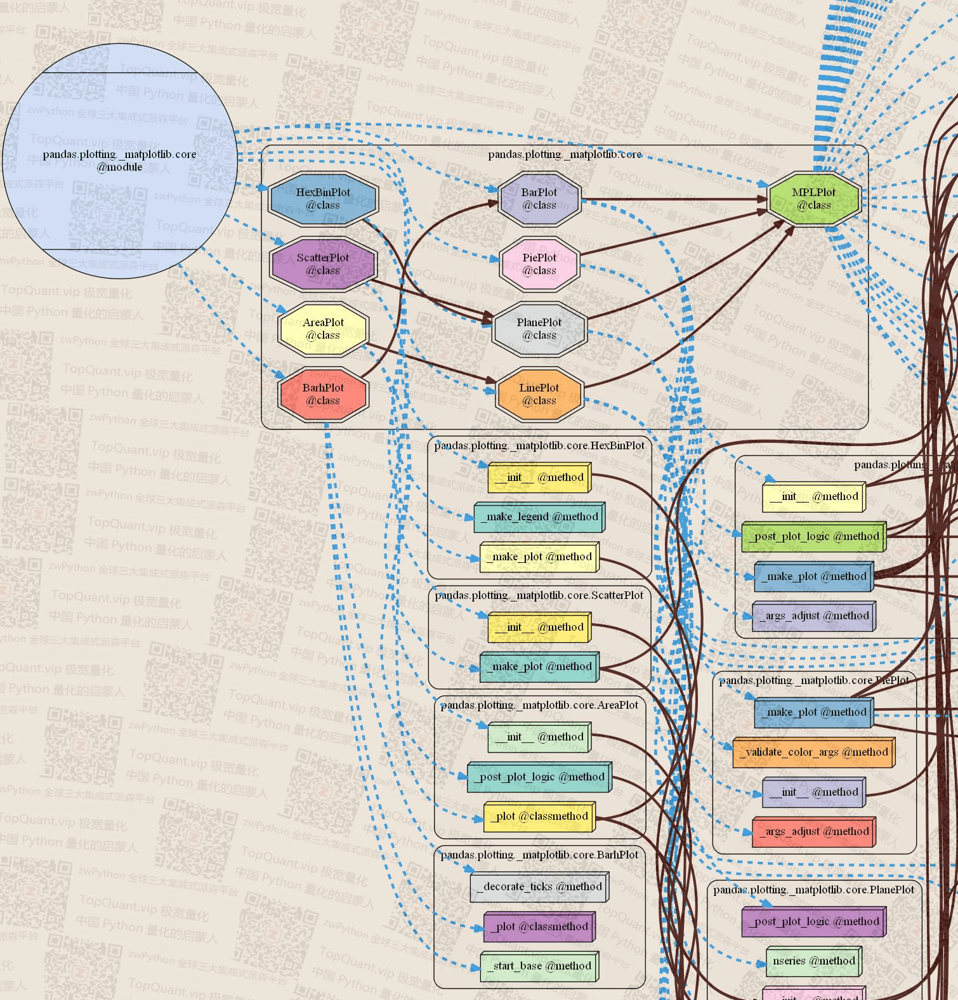
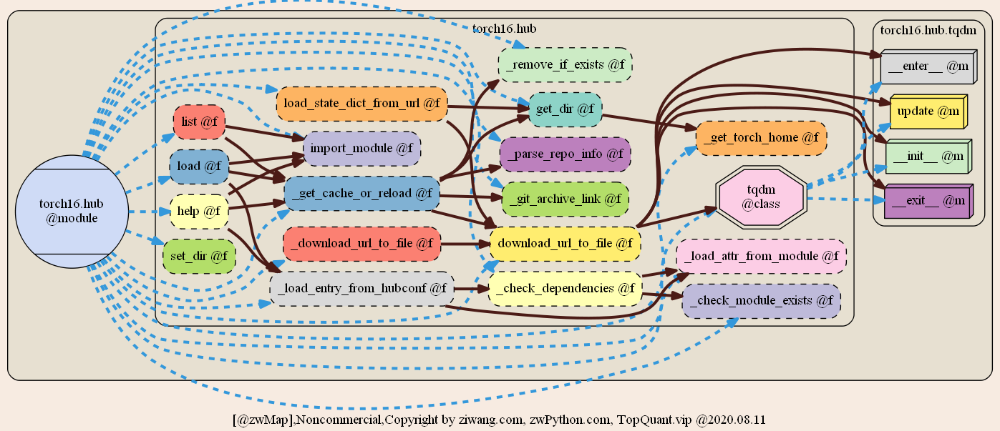

# zwMAP

zwMap: This is an introduction to zwMap, which is a series of module library diagrams about Python, including all class libraries.
zwMap: 这是对zwMap的介绍，它是一系列关于Python的模块库架构图，包括所有类库。

Now the ball is in your court. As a freshman, you could decide whether you’re going to make the effort to get more serious about studying Python. zwMap is the sword to help you do  more thru stick a hole in the digital world’s shield.
千言万语不如一张图，小白入门学习神器。

  The module library diagrams also known as Functional structure diagram, which is an equivalent of that circuit schematics for hardware devices.
No matter beginners’ first lesson or the man who make RE ( Reverse Engineering) and OPS （Open Source Project）, it is essential.
模块库架构图，又称：功能结构图，相当于硬件设备的电路图。无论是初学者启蒙入门，还是逆向工程、开源项目，都是必不可少的。 

The module library diagrams updated March 18 2021.
本期更新的模块库包括：

albumentations,backtrader,biopython,bokeh,bs4,caffe2,ccxt,dash,django,eli5,empyrical,fastai,fastapi,fastcore,flask,fontTools,gensim,gluon,gym,hiplot,hummingbird,mxnet,IPython,jieba,keras,librosa,lightgbm,lime,matplotlib,metrics,nltk,numpy,pandas,PIL,pl-flash,plotly,pl-bolts,lightning,pydicom,pyecharts,pyfolio,pygame,pytest,robobrowser,scipy,scrapy,seaborn,selenium,skimage,sklearn,spacy,statsmodels,tensorflow,tensorlayer,tf-datasets,theano,torch,torch_geometric,torchaudio,torchmetrics,torchtext,torchvision,tpot,transformers,xgboost,zipline
……

Further updates will follow on GitHub. You can also follow the latest news from zwPython.com, or ziwang.com, also topquant.vip. The WeChat Official Accounts TOP 极宽量化(WeChat ID: zwpython_com) welcome your attention to check for the hot news.
后续更新也会及时跟进到Github上，大家也可以关注网址：zwPython.com，或ziwang.com，或TopQuant.vip，及TOP极宽量化（微信号:zwpython_com）微信公众号的最新消息。

全部一千多个Python主流模块库（约16G），均已上传到zw百度网盘，提供免费下载。
--------------
【zw模块库架构图·网盘】
[ZW module library frame composition · online disk]
@zwmap,download ： https://pan.baidu.com/s/194KsRHjXTP_DYvx1ylcaVw  提取码password： zbq2

其他资源，参见【zw百度网盘2020】
链接：https://pan.baidu.com/s/1lCMNVJW00cpR_EJ0YLDeCA   提取码password： jolm
zwPython，Top极宽量化相关软件&amp;课件、数据包，均在zw百度网盘发布。

如以上网盘失效，请访问 zwPython.com，或者TopQuant.vip，网站【下载中心】有最新的下载地址信息
www.topquant.vip/?p=56
