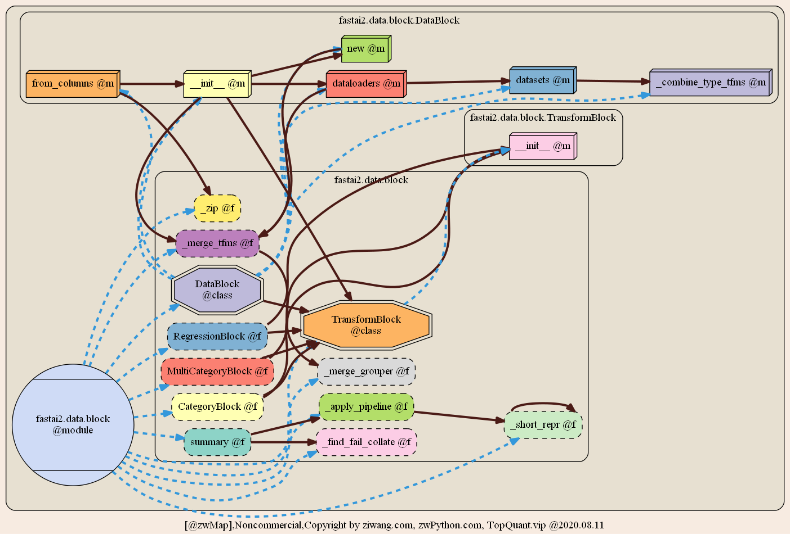

# zwMAP

zwMap:Python模块库架构图;千言万语不如一张图，全系列Python各种模块库架构图，小白入门学习神器。 zwMap:Python Module library frame composition.A picture is worth a thousand words. The whole series of Python module library frame composition, Xiaobai beginner learning artifact.

模块库架构图，又称：功能结构图，相当于硬件设备的电路图，无论是初学者，还是高级程序员，都是必不可少的。
Module library frame composition, also known as: functional structure diagram, is equivalent to the circuit diagram of hardware equipment. It is essential for both beginners and advanced programmers.

其作用，相当于《智取威虎山》中先遣图：
Its function is equivalent to that of the forerunner picture in "taking the tiger mountain by wisdom":

《智取威虎山》中先遣图一共有三张，分别是先遣军联络图、弹药分布图和藏宝图。座山雕迫切需要的《先遣图》有：先遣军的分布位置（约7000人）、前东北军弹药的分布(共计有6座秘密弹药库)、和前东北军的张作霖藏宝图（其中有20吨黄金）。
There are three advance maps in "taking Weihu mountain by wisdom", which are the contact map of the advance troops, the ammunition distribution map and the treasure map. The "advance map" urgently needed by Zuoshan carving includes: the location of the advance troops (about 7000 people), the distribution of ammunition of the former Northeast Army (a total of six secret ammunition depots), and the treasure map of Zhang zuolin of the former Northeast Army (including 20 tons of gold).

在杨子荣上山后，献了《先遣图》，历经多次考查均评为合格，终于得到了座山雕的信任，并破封为“上校团副”的威虎山老九。
After Yang Zirong went up the mountain, he presented the advance map. After many examinations, he was rated as qualified. Finally, he got the trust of the mountain carving and broke the title of Wei Hu Mountain Lao Jiu, who was named "deputy of the Colonel regiment".

功能结构图是对硬件、软件、解决方案等进行解剖，详细描述功能列表的结构，构成，剖面的从大到小，从粗到细，从上到下等而描绘或画出来的结构图。
Function structure diagram is the structure diagram that dissects the hardware, software and solutions, describes the structure and composition of function list in detail, and describes the structure of section from large to small, from coarse to fine, from top to bottom.

对于Python等开源项目，与商业软件的一个核心差异，就在于缺乏技术支持，其中的关键，就是缺乏项目系统的模块库架构图。
For Python and other open source projects, a core difference with commercial software lies in the lack of technical support. The key is the lack of module library framework composition of the project system.

TopQuant极宽开源团队，参考有关专业的流程图设计系统，以及思维导图软件，采用zwPython（全球三大Python开发平台），完成了Python全系列模块库架构彩图的设计：zw版Python全系列模块库架构彩图。
With reference to the professional flow chart design system and mind map software, topquant has completed the design of the full series of Python module library architecture color chart: ZW version Python full series module library architecture color chart.

与以往的Python模块库架构图相比，“zw版Python全系列模块库架构彩图”，具有以下优势：
Compared with the previous Python module library frame composition, "ZW version Python full series module library architecture color chart" has the following advantages:

:: 支持所有标准Python模块库，特别是zwPython集成的数千个主流模块库。
:: supports all standard Python module libraries, especially thousands of mainstream module libraries integrated by zwpython.

:: 在传统模块库级架构图基础上进一步细化，支持到class子函数级别。
:: it is further refined on the basis of the traditional module library level architecture diagram, and supports to the class sub function level.

:: 通吃，类似 backtrader 软件的模块架构图，只有10-20张子图，zw版本全套接近150套子图，基本上每个源码文件，都有对应的模块架构图。
: take it all, similar to the module architecture diagram of backtrader software, there are only 10-20 subgraphs. The ZW version has nearly 150 sets of subgraphs. Basically, each source file has a corresponding module architecture diagram.

:: 32位4通道全彩色高清版，精心设计的现代风格色彩体系，准3D图标，精美柔和，不易视觉疲劳。
: 32-bit 4-channel full-color high-definition version, well-designed modern style color system, quasi-3D icon, exquisite and soft, not easy to visual fatigue.

近期，会在TopQuant.vip网站，公众号和Github，陆续发布各种常用的Python模块库架构彩图，首批超过一千多个Python主流模块库：
In the near future, the TopQuant.vip Websites, public numbers and Github have released various commonly used Python module library structure color maps, the first official account of more than more than 1000 Python main modules:
backtrader，zipline，pandans，TensorFlow，PyTorch、Keras等等
Backtrader, zipline, pandans, tensorflow, pytorch, keras, etc

为了防止盗版，所有模块架构图，都采用了水印背景。
In order to prevent piracy, all module architecture diagrams adopt watermark background.

ps，商务版本，无水印背景。
PS, business version, no watermark background.

请大家注意zwPython.com,ziwang.com，TopQuant.vip网站，公众号的最新消息。
Attention, please zwPython.com , ziwang.com , TopQuant.vip Website, official account of the public.

全部一千多个Python主流模块库（约16G），均已上传到zw百度网盘，提供免费下载。 
All of the more than 1000 Python mainstream module libraries (about 16g) have been uploaded to ZW Baidu disk for free download.
--------------
【zw模块库架构图·网盘】
[ZW module library frame composition · online disk]
@zwmap,download ： https://pan.baidu.com/s/194KsRHjXTP_DYvx1ylcaVw  提取码password： zbq2

--------------
其他资源，参见【zw百度网盘2020】 
For other resources, see [ZW Baidu disk 2020]
链接：https://pan.baidu.com/s/1lCMNVJW00cpR_EJ0YLDeCA 提取码password： jolm 
 
 zwPython，Top极宽量化相关软件&课件、数据包，均在zw百度网盘发布。 
 zwpython, top extremely wide quantization related software & courseware, data package, are released in ZW Baidu online disk.

--------------
如以上网盘失效，请访问 zwPython.com，或者TopQuant.vip，网站【下载中心】有最新的下载地址信息
If the above network disk fails, please visit zwPython.com Or TopQuant.vip，
The website [download center] has the latest download address information
www.topquant.vip/?p=56

------------

【极宽QQ群】
[QQ group]
群号：1057170501 ，zwPython.com学习QQ群，面向py初学者和大众小白用户。
No. 7071501, zwPython.com Learning QQ group, facing py beginners and public small white users.
群号：124134140，TOP极宽金融量化，三千人超大QQ群，面向专业金融实盘用户。
Group number: 124134140, top extremely wide financial quantification, 3000 people super large QQ group, for professional financial real offer users.
群号：699266891，TFB极宽足球大数据QQ群
Group number: 699266891, TFB football big data QQ group

【微信公众号】

The official account of WeChat
请大家关注TOP极宽量化公众号，大量原创Python量化技术资料和课件、案例源码。目前推广期间，关注公众号，即可免费浏览。
Please pay attention to TOP extremely wide official account, a large number of original Python quantitative technical information and courseware, case source. The official account can be freely viewed during the promotion period.

---------------------------  
@zwmap2020m8lst.txt
首批zwMAP模块库架构图，约一千多个主流模块库，全部压缩包约16G，模块库名称列表如下： 
The first batch of zwmap module library frame composition, about 1000 mainstream module libraries, all compressed packages about 16g, the module library name list is as follows: 
-------- -------- -------- 

absl , 
addict , 
adodbapi , 
affine , 
aiodns , 
aiofiles , 
aiohttp , 
aipipeline , 
akshare , 
alabaster , 
albumentations , 
alembic , 
algopy , 
algorithms , 
alipay , 
allennlp , 
alphalens , 
alphapy , 
altair_data_server , 
altair_transform , 
altair_widgets , 
altair , 
altgraph , 
amqp , 
analyzerdam , 
analyzerstrategies , 
aniso8601 , 
ansiwrap , 
anyjson , 
anyqt , 
apache_beam , 
apipkg , 
apitools , 
appier , 
apptools , 
arctic , 
arff , 
argh , 
arrayfiles , 
arrayfire , 
arrow , 
asciitree , 
asn1crypto , 
aspy , 
asteval , 
astor , 
astroid , 
astroml , 
astropy , 
asttokens , 
async_generator , 
asyncio , 
atomicwrites , 
attrdict , 
attr , 
audioread , 
audio , 
augmentor , 
auto_dl , 
auto_ml , 
autobahn , 
autokeras , 
automat , 
autopytorch , 
autosubsync , 
avro , 
aws , 
babel , 
backcall , 
backports , 
backtrader_plotting , 
backtrader , 
baresql , 
base58 , 
bcolz , 
bcrypt , 
beeprint , 
benchmark , 
better_exceptions , 
bidi , 
bigone , 
billiard , 
bimdp , 
binance , 
bintrees , 
bin , 
biosql , 
bio , 
birdseye , 
bitcoinrpc , 
bitcoin , 
bitfinex , 
bitmerchant , 
bittrex , 
bkcharts , 
blaze , 
bleach , 
blessings , 
blib2to3 , 
blinker , 
blis , 
bloscpack , 
blosc , 
bokeh , 
boltons , 
booleanoperations , 
boto3 , 
botocore , 
botorch , 
boto , 
bottleneck , 
bounter , 
boxx , 
bqplot , 
branca , 
brewer2mpl , 
bs4 , 
bson , 
btalib , 
btcquant , 
btrees , 
cachecontrol , 
cachetools , 
caffe2 , 
cairocffi , 
cairosvg , 
cairo , 
captum , 
cartopy , 
catalyst , 
cchardet , 
ccxt , 
ccy , 
ceevee , 
celery , 
certifi , 
cffi , 
chaco , 
chainermn , 
chainerx , 
chainer , 
chardet , 
charlcd , 
chartify , 
cheap_repr , 
cheroot , 
cherrypy , 
click_plugins , 
click , 
cligj , 
clint , 
cloudpickle , 
clusterlib , 
cn_stock_src , 
coconut , 
coincurve , 
collections , 
colorama , 
colorcet , 
coloredlogs , 
colorful , 
colorlog , 
colorlover , 
colormath , 
colour , 
commandlines , 
commonmark , 
commontools , 
common , 
community , 
compreffor , 
comtypes , 
concurrent , 
configspace , 
constantly , 
convertdate , 
coverage , 
cpuinfo , 
crcmod , 
cryptodome , 
cryptography , 
cryptokit , 
crypto , 
cssselect2 , 
cssselect , 
cssutils , 
ctypes , 
cu2qu , 
cuda4py , 
cufflinks , 
cupyx , 
cupy , 
curio , 
curses , 
cutecharts , 
cvxopt , 
cvxpy , 
cx_freeze , 
cyordereddict , 
cython , 
cytoolz , 
dash_table , 
dash_ui , 
dash , 
dask_searchcv , 
dask , 
databases , 
dataproperty , 
datasette , 
datashader , 
datashape , 
dateparser , 
dateutil , 
dbm , 
db , 
deap , 
debtcollector , 
decimalpy , 
defconqt , 
defcon , 
defusedxml , 
delorean , 
demos , 
deprecated , 
descartes , 
detecto , 
detectron2 , 
diff_match_patch , 
dill , 
distributed , 
distutils , 
dmlc_tracker , 
dns , 
docrepr , 
docs , 
docutils , 
docx , 
dogpile , 
dominate , 
dtreeviz , 
dukpy , 
dx , 
easycoins , 
easydev , 
easyquotation , 
easytrader , 
easyutils , 
ebooklib , 
ecdsa , 
ecpy , 
editor , 
edward , 
eli5 , 
email , 
emcee , 
empyrical , 
encodings , 
encore , 
encutils , 
engineio , 
ensurepip , 
enum , 
envisage , 
ephem , 
et_xmlfile , 
etcd , 
ete3 , 
eth_abi , 
eth_account , 
eth_hash , 
eth_keyfile , 
eth_keys , 
eth_rlp , 
eth_utils , 
eventlet , 
events , 
examples , 
execjs , 
execnet , 
extractor , 
extras , 
ezibpy , 
ezprogbar , 
facebook , 
fann2 , 
farm , 
fast_histogram , 
fastai2 , 
fastai , 
fastavro , 
fastbt , 
fastcache , 
fastdot , 
fasteners , 
fastparquet , 
fastprogress , 
fasttext , 
ffmpeg , 
ffn , 
finance , 
finmarketpy_examples , 
finmarketpy , 
fiona , 
fire , 
fixtures , 
flair , 
flake8 , 
flambe , 
flashtorch , 
flask_accepts , 
flask_cors , 
flask_humanize , 
flask_restplus , 
flask_socketio , 
flaskerize , 
flask , 
fn , 
fontdump , 
fontline , 
fontmake , 
fontmath , 
fontparts , 
fontpens , 
fonttools , 
freetype , 
fsspec , 
fs , 
ftfy , 
funcsigs , 
functions , 
future , 
futurist , 
fuzzywuzzy , 
gaft , 
gast , 
geographiclib , 
geopandas , 
geopy , 
geoviews , 
gevent , 
ggplot , 
ghost , 
git , 
gluoncv , 
gluon , 
glyphslib , 
gmsh_interop , 
google_auth_oauthlib , 
google_drive_downloader , 
googleapiclient , 
googlefinance , 
googlemaps , 
google , 
gpustat , 
gputil , 
gpytorch , 
graphviz , 
graspy , 
gridfs , 
grpc , 
guidata , 
guiqwt , 
gym , 
h2o , 
h2 , 
h5py , 
h11 , 
hamcrest , 
hdfs , 
helpdev , 
hexbytes , 
hikyuu , 
hmmlearn , 
holidays , 
holoviews , 
hpack , 
hpbandster , 
html2text , 
html5lib , 
htmlmin , 
html , 
httplib2 , 
httpretty , 
http , 
humanfriendly , 
humanize , 
huobi_client , 
hupper , 
hvplot , 
hypercorn , 
hyperframe , 
hyperlink , 
hyperopt , 
hypothesis , 
ib , 
icecream , 
identify , 
idlelib , 
idlexlib , 
idna , 
igraph , 
imageai , 
imagededup , 
imagehash , 
imageio_ffmpeg , 
imageio , 
imblearn , 
imgaug , 
immutables , 
importlib_metadata , 
importlib , 
incremental , 
inferno , 
int_date , 
intake , 
intervaltree , 
ipydatawidgets , 
ipykernel , 
ipyleaflet , 
ipympl , 
ipyparallel , 
ipyscales , 
ipython_genutils , 
ipython , 
ipyvolume , 
ipywebrtc , 
ipywidgets , 
isapi , 
iso8601 , 
isodate , 
isort , 
itsdangerous , 
jaraco , 
jax , 
jedi , 
jhtalib , 
jiagu , 
jieba_fast , 
jieba , 
jinja2 , 
jmespath , 
joblib , 
json_tricks , 
json5 , 
jsonpickle , 
jsonschema , 
jsonstruct , 
json , 
julia , 
jupyter_client , 
jupyter_console , 
jupyter_core , 
jupyter_server , 
jupyter_sphinx , 
jupyterlab_launcher , 
jupyterlab_server , 
jupyterlab , 
jupyterpip , 
jwt , 
kalman , 
keras_adversarial , 
keras_applications , 
keras_preprocessing , 
keras_retinanet , 
kerastoolbox , 
kerastuner , 
keras , 
kerutils , 
keychain , 
keylib , 
keyrings , 
keyring , 
keystoneauth1 , 
keystoneclient , 
keystonemiddleware , 
klein , 
kombu , 
kornia , 
kucoin , 
kutilities , 
lama , 
larq , 
lasagne , 
latexcodec , 
lazy_object_proxy , 
levenshtein , 
lib2to3 , 
lib3to2 , 
libfuturize , 
libpasteurize , 
librosa , 
lightgbm , 
lime , 
linecache2 , 
lineflow , 
littleutils , 
llvmlite , 
lmfit , 
lml , 
locket , 
lockfile , 
logbook , 
logging , 
loguru , 
logutils , 
logzero , 
loky , 
louvain , 
lxml , 
lz4 , 
macholib , 
macropy , 
madmom , 
magenta , 
mahotas , 
mako , 
markdown , 
markupsafe , 
marshmallow , 
mathematical_meta_code , 
matplotlib , 
mayavi , 
mbstrdecoder , 
mdp , 
mercantile , 
meshpy , 
metakernel , 
metapensiero , 
migrate , 
milksets , 
milk , 
mining , 
missingno , 
mizani , 
mkl , 
mlbox , 
mlflow , 
mlpy , 
mlxtend , 
mmcv , 
mockextras , 
modin , 
moneyed , 
moneywagon , 
monty , 
more_itertools , 
motor , 
moviepy , 
mox3 , 
mp3play , 
mpd , 
mpl_scatter_density , 
mpl_toolkits , 
mpld3 , 
mpldatacursor , 
mplotly , 
mpmath , 
msgfy , 
msgpack , 
msilib , 
muffnn , 
multidict , 
multipledispatch , 
multiprocessing , 
multiprocess , 
multitasking , 
munch , 
muse , 
mutatormath , 
mxnet , 
mypyc , 
mypy , 
mysqlx , 
mysql , 
nacl , 
naked , 
nbconvert_reportlab , 
nbconvert_watch , 
nbconvert , 
nbformat , 
ndg , 
netaddr , 
netcdf4 , 
netron , 
networkx , 
neural , 
nexmo , 
nibabel , 
nisext , 
nitime , 
nltk , 
nni_annotation , 
nni_cmd , 
nni_gpu_tool , 
nni_trial_tool , 
nnicli , 
nni , 
nose , 
notebook , 
nsequoter , 
numba , 
numbergen , 
numcodecs , 
numdifftools , 
numexpr , 
numpy_groupies , 
numpydoc , 
numpy , 
nx_altair , 
oauth2client , 
oauthlib , 
oct2py , 
octave_kernel , 
odo , 
olefile , 
onmt , 
onnx_chainer , 
onnx , 
open3d , 
opencl4py , 
opencv_transforms , 
opendatatools , 
opengl , 
openml , 
opennmt , 
openpyxl , 
openssl , 
opentsne , 
opt_einsum , 
optuna , 
orangecanvas , 
orangecontrib , 
orangewidget , 
orange , 
os_service_types , 
oset , 
osgeo , 
oslo_cache , 
oslo_concurrency , 
oslo_config , 
oslo_context , 
oslo_db , 
oslo_i18n , 
oslo_log , 
oslo_messaging , 
oslo_middleware , 
oslo_policy , 
oslo_serialization , 
oslo_service , 
oslo_utils , 
oslo_versionedobjects , 
osqppurepy , 
osqp , 
outdated , 
packaging , 
paddlehub , 
paddle , 
palettable , 
pandapy , 
pandarallel , 
pandas_datareader , 
pandas_finance , 
pandas_market_calendars , 
pandas_profiling , 
pandas_summary , 
pandas_ta , 
pandas_validator , 
pandasql , 
pandasurvey , 
pandas , 
panel , 
papermill , 
parallel , 
parambokeh , 
paramiko , 
paramnb , 
param , 
parlai_internal , 
parlai , 
parl , 
parsel , 
parsimonious , 
parso , 
partd , 
passlib , 
pasta , 
paste , 
past , 
pathos , 
pathspec , 
pathtools , 
pathvalidate , 
patsy , 
pattern3 , 
pbr , 
pdfminer , 
pdfrw , 
pdir , 
pdvega , 
pecan , 
pendulum , 
peppercorn , 
persistent , 
pexpect , 
pg8000 , 
pgmagick , 
phik , 
piader_1_1 , 
picklable_itertools , 
pika , 
pil , 
pinkfish , 
pint , 
pip , 
pkg_resources , 
pkginfo , 
pkuseg , 
pl_examples , 
planar , 
plotly , 
plotnine , 
plotoptix , 
pluggy , 
plumbum , 
ply , 
pmg_qt , 
pmg_tk , 
pmprophet , 
pmw , 
polyglot , 
polygon , 
portalocker_tests , 
portalocker , 
pox , 
ppci , 
ppft , 
pp , 
pre_commit , 
preshed , 
pretrainedmodels , 
pretty_errors , 
prettyplotlib , 
prettyprinter , 
prettytensor , 
priority , 
proglog , 
progressbar , 
projects , 
prometheus_client , 
prompt_toolkit , 
prophet , 
prov , 
psutil , 
ptpython , 
ptyprocess , 
pulp , 
pweave , 
py_ecc , 
py3lib , 
pyalgotrade , 
pyan , 
pyarrow , 
pyasn1_modules , 
pyasn1 , 
pyaudioanalysis , 
pya , 
pybars , 
pybind11 , 
pybittrex , 
pybraries , 
pybtex , 
pycadf , 
pycair , 
pycallgraph , 
pycares , 
pyconvert , 
pycorrector , 
pycparser , 
pyct , 
pycuda , 
pydeck , 
pydeps , 
pydiogment , 
pydispatch , 
pydocstyle , 
pydot_ng , 
pydotplus , 
pyecharts_javascripthon , 
pyecharts_jupyter_installer , 
pyecharts , 
pyee , 
pyexpect , 
pyface , 
pyfinance , 
pyfin , 
pyflakes , 
pyflow , 
pyflux , 
pyfolio , 
pyforest , 
pygal , 
pygame , 
pygbm , 
pyglet , 
pygments , 
pyhdf , 
pyinstaller , 
pykalman , 
pykeyboard , 
pylint , 
pyls_jsonrpc , 
pyls , 
pymavlink , 
pymc3 , 
pymc , 
pymeta , 
pymol2 , 
pymol , 
pymongo , 
pymouse , 
pymysql , 
pynndescent , 
pyod , 
pyopencl , 
pyosf , 
pypandoc , 
pypdf , 
pyperclip , 
pypinyin , 
pypistats , 
pyppeteer , 
pyprind , 
pyproj , 
pyqt5 , 
pyqtgraph , 
pyquery , 
pyrallel , 
pyray , 
pyreadline , 
pyro4 , 
pyrsistent , 
pyside2 , 
pysnooper , 
pystache , 
pystock_crawler , 
pytablewriter , 
pytdx , 
pytesseract , 
pytext , 
python_algorithms , 
python_utils , 
pythonmagick , 
pythonwin , 
pythreejs , 
pytocl , 
pytools , 
pytorch_lightning , 
pytzdata , 
pytz , 
pyvips , 
pyvisa , 
pyviz_comms , 
pyvtk , 
pywinauto , 
pywinusb , 
pywt , 
pyximport , 
pyx , 
pyzo , 
py , 
qbstyles , 
qdarkstyle , 
qfrm , 
qqpat , 
qrcode , 
qrisk , 
qtawesome , 
qtconsole , 
qtk , 
qtpy , 
quandl , 
quantaxis , 
quantecon , 
quantiacstoolbox , 
quantitative , 
quart , 
quaternion , 
queuelib , 
quoine , 
qwt , 
rasa_nlu , 
rasterio , 
rdflib , 
readme_renderer , 
recommonmark , 
redis , 
regex , 
reikna , 
release , 
reportlab , 
repoze , 
requests_cache , 
requests_ftp , 
requests_oauthlib , 
requests_toolbelt , 
requests , 
resampy , 
rfc3986 , 
rlp , 
robobrowser , 
rope , 
rotation , 
routes , 
rpy2 , 
rqalpha , 
rqopen_client , 
rq , 
rsa , 
rtree , 
ruamel , 
rx , 
s3fs , 
s3transfer , 
sacremoses , 
samplesystems , 
scikits , 
scilab2py , 
scimath , 
scipy , 
scrapy , 
seaborn , 
segmentation_models_pytorch , 
selenium , 
send2trash , 
seqlearn , 
serial , 
serverfiles , 
service_identity , 
setuptools , 
shapely , 
shapes , 
shap , 
shiboken2 , 
shutil_backports , 
simplebitcoinfuncs , 
simplecv , 
simplejson , 
simpleutils , 
simpy , 
sipbuild , 
skbuild , 
skflow , 
skfuzzy , 
skimage , 
sklearn_pandas , 
sklearn , 
skmisc , 
sknn , 
skopt , 
skorch , 
skvideo , 
smart_open , 
snakeviz , 
snappy , 
snowballstemmer , 
snownlp , 
snowy , 
snuggs , 
socketio , 
sortedcollections , 
sortedcontainers , 
soupsieve , 
spacy , 
speck , 
spectrum , 
speedtorch , 
sphinxcontrib , 
sphinx , 
sputnik , 
spyder_kernels , 
spyder_notebook , 
spyder_terminal , 
spyder_unittest , 
spyder , 
sqlalchemy , 
sqlite_bro , 
sqlite3 , 
sqlparse , 
sql , 
srsly , 
standardstreams , 
stanfordnlp , 
stanza , 
statistics , 
statsd , 
statsmodels , 
stevedore , 
stopit , 
streamlit , 
streamz , 
string_algorithms , 
stylecloud , 
subsync , 
supersmoother , 
svglib , 
svgpathtools , 
svgwrite , 
svg , 
swifter , 
sympy , 
tabledata , 
tables , 
taichi , 
talib , 
tangled_up_in_unicode , 
tatsu , 
tb_paddle , 
tblib , 
tempita , 
tempodb , 
tempora , 
tenacity , 
tensorboardx , 
tensorboard , 
tensorflow_core , 
tensorflow_estimator , 
tensorflow_hmm , 
tensorflow_hub , 
tensorflow_probability , 
tensorflow_transform , 
tensorflow , 
tensorlayer , 
terminado , 
terminaltables , 
termplotlib , 
testpath , 
testresources , 
testscenarios , 
tests , 
testtools , 
test , 
texar , 
textacy , 
textblob , 
textdistance , 
tflearn , 
theano , 
thinc , 
thriftpy , 
thrift , 
tia , 
tinycss2 , 
tkinter , 
tlz , 
toapi , 
tokenizers , 
toml , 
toolz , 
torch_extras , 
torch_geometric , 
torchcv , 
torchelastic , 
torchfold , 
torchfunc , 
torchline , 
torchnet , 
torchsummary , 
torchtext , 
torchtoolbox , 
torchvision , 
torchviz , 
torch , 
tornado , 
tox , 
tpot , 
tqdm , 
traceback2 , 
trading_calendars , 
traitlets , 
traitsui , 
traits , 
traittypes , 
transformers , 
transforms3d , 
translate , 
triangle , 
trufont , 
ttfquery , 
tubes , 
turtledemo , 
tushare , 
tvtk , 
tweepy , 
twilio , 
twine , 
twisted , 
twitter , 
twython , 
txaio , 
typed_ast , 
typepy , 
tzlocal , 
u2flib_host , 
ufo2ft , 
ufolib , 
uncertainties , 
unidecode , 
unittest2 , 
unittest , 
uritemplate , 
urllib3 , 
urllib , 
urwid , 
utilitybelt , 
utils , 
uvicorn , 
vadersentiment , 
validators , 
vapory , 
vega_datasets , 
vega3 , 
vega , 
venv , 
vine , 
virtualenv , 
visdom_plotly , 
visdom , 
visions , 
vispy , 
visualdl , 
visualportfolio , 
visvis , 
vis , 
vitables , 
vnpy , 
voila , 
vtk , 
w3lib , 
waitress , 
wasabi , 
watchdog , 
wcwidth , 
weasyprint , 
webencodings , 
webob , 
websockets , 
websocket , 
webtest , 
wechatpy , 
werkzeug , 
werobot , 
wheel , 
win_unicode_console , 
win32comext , 
win32com , 
win32ctypes , 
win32 , 
winpty , 
winpython , 
winrt , 
wordcloud , 
wrapt , 
ws4py , 
wsgiref , 
wsmeext , 
wsme , 
wsproto , 
x86cpu , 
xarray , 
xgboost , 
xlrd , 
xlsxwriter , 
xlwings , 
xmlrpc , 
xml , 
xquant , 
yacs , 
yahoo_finance , 
yaml , 
yapftests , 
yapf , 
yarl , 
yawttk , 
yfinance , 
zarr , 
zc , 
zenlog , 
zhconv , 
zict , 
zipline_cn_databundle , 
zipline_extensions , 
zipline , 
zmq , 
zope , 
